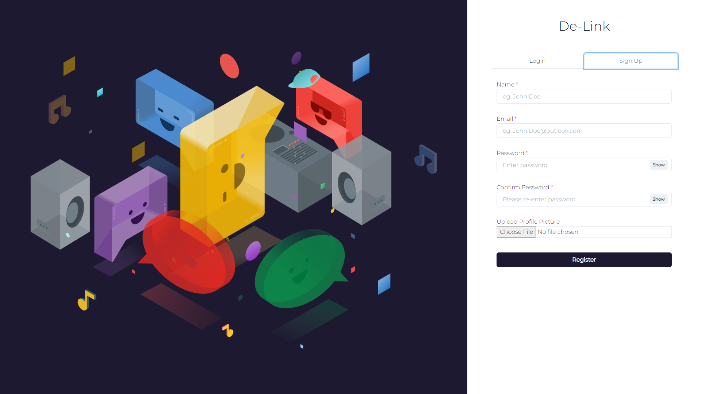
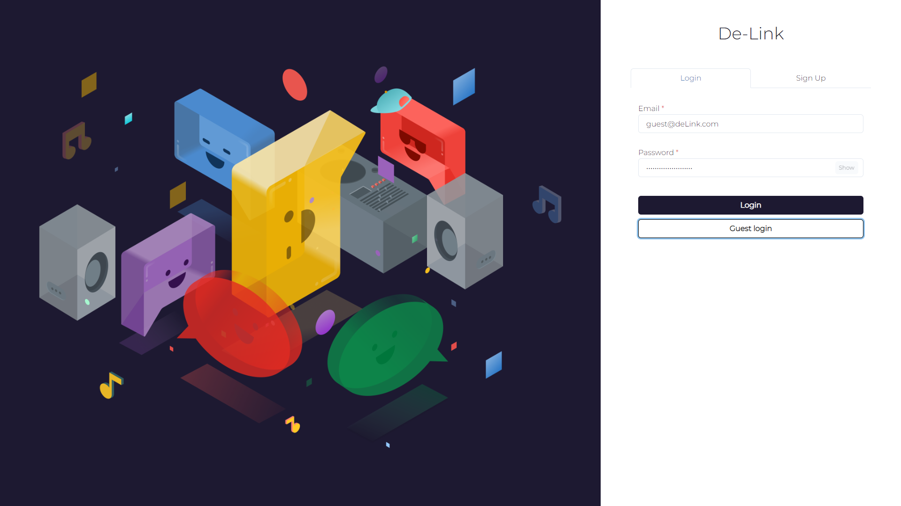
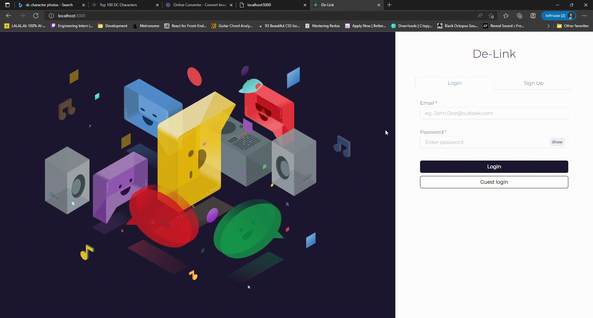
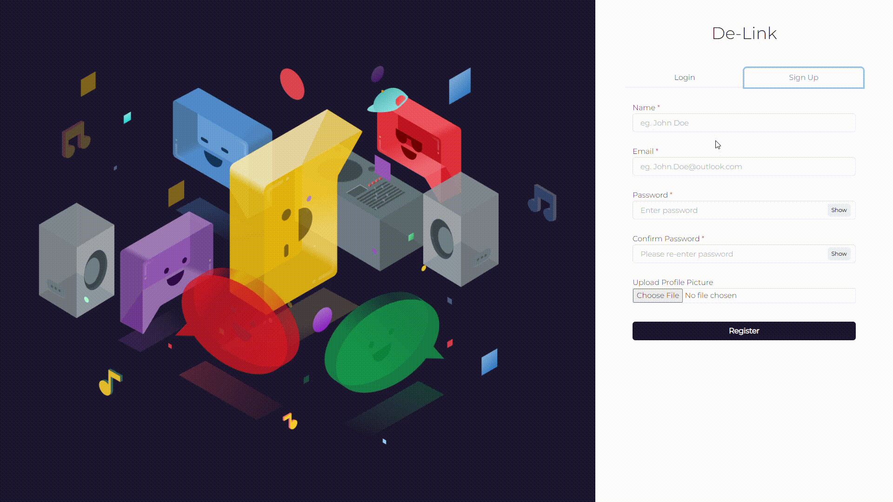
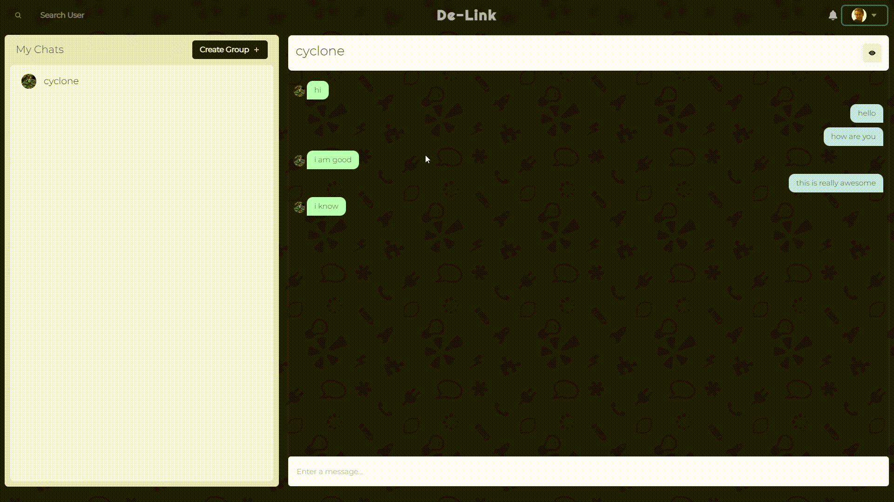
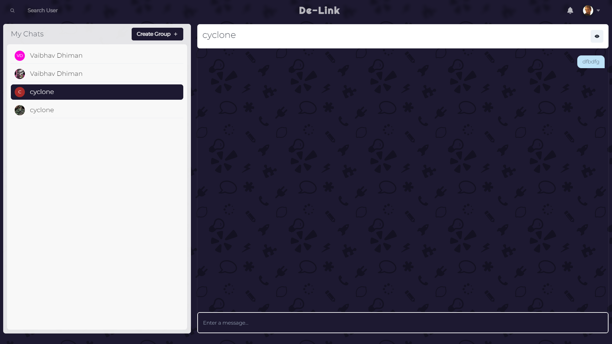
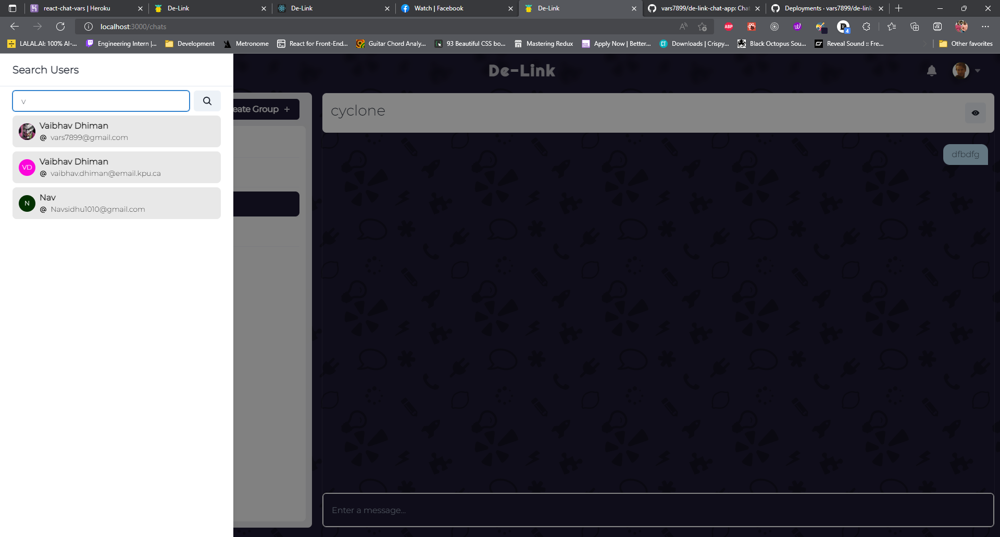
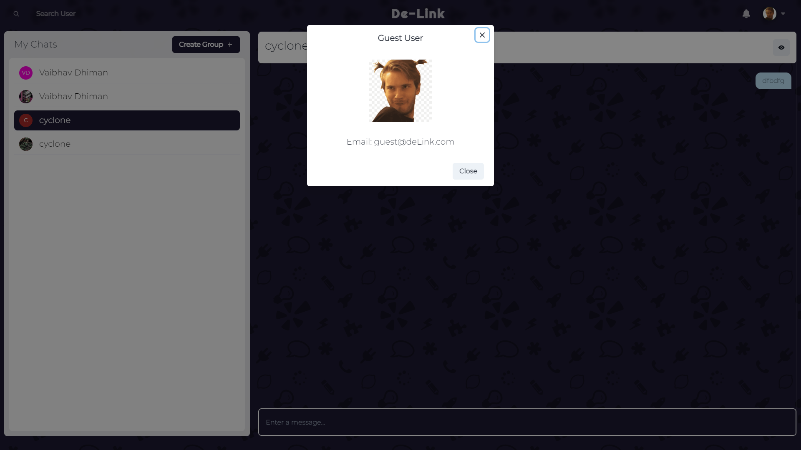
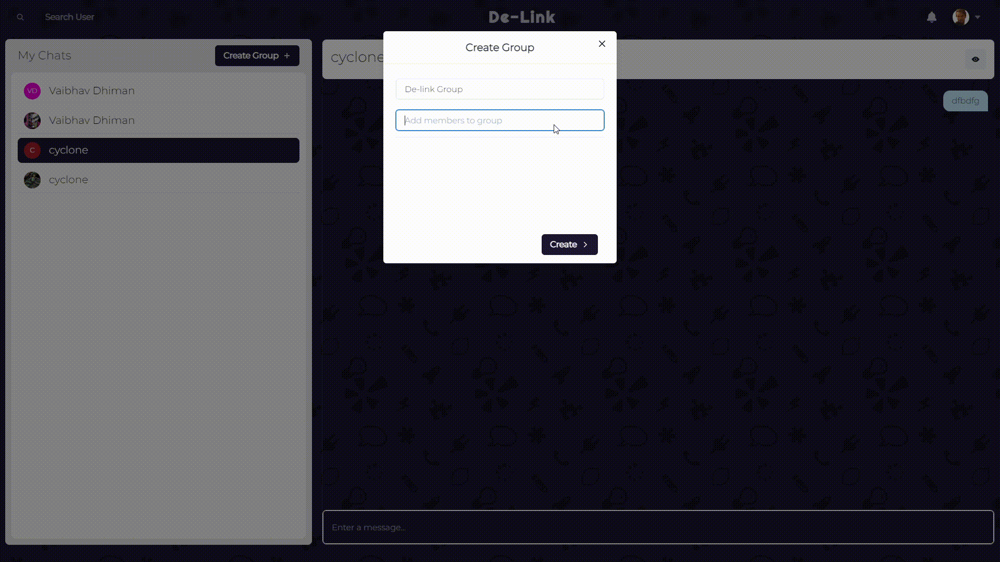
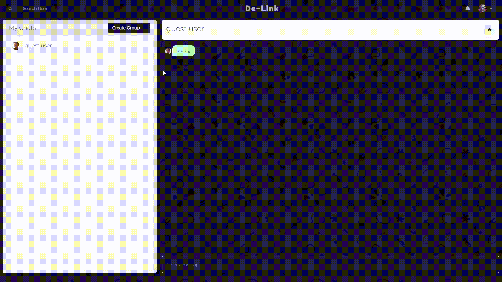

## CHAT APP using MERN stack and SOCKET.IO 🤠

- Visit <https://react-chat-vars.herokuapp.com/>

---

### Features

- Authentication
- Real-time chat
- Real-time Notification
- Typing indicator
- Guest login
- Group chat
- One-on-one chat
- Responsive

---

#### Demo

## 

## 

## 

### Guest User

## 

### User Signup

## 

### Search User

## 

### View Profile

## 

### Guest User

## 

### Search User

## 

### Your profile

## 

### Create Group

## 

## 

---

**Version 1.0.0**

Code and documents to create real-time chat application using the following stack

- MongoDB (Database)
- ExpressJS (Web application framework)
- NodeJS (JavaScript Runtime)
- React (Frontend framework)
- Socket.io (web sockets for real time chat)

#### Other dependencies

- colors <https://www.npmjs.com/package/colors>
- nodemon <https://www.npmjs.com/package/nodemon>
- mongoose <https://www.npmjs.com/package/mongoose>
- chakra <https://chakra-ui.com/>
- framer-motion <https://www.framer.com/motion/>
- react-router-dom <https://www.npmjs.com/package/react-router-dom>
- react-toastify <https://www.npmjs.com/package/react-toastify>
- express-async-handler <https://www.npmjs.com/package/express-async-handler>
- jsonwebtoken <https://www.npmjs.com/package/jsonwebtoken>
- bcrypt <https://www.npmjs.com/package/bcrypt>
- react-icons <https://react-icons.github.io/react-icons/icons?name=io5>
- react-scrollable-feed <https://www.npmjs.com/package/react-scrollable-feed>

---

#### File structure

client
|───────────src
│ App.css
│ App.js
│ index.css
│ index.js
│
├───components
│ ChatBox.jsx
│ GroupChatModal.jsx
│ Loader.jsx
│ Login.jsx
│ MyChats.jsx
│ ProfileModel.jsx
│ Register.jsx
│ ScrollableChat.jsx
│ SideDrawer.jsx
│ SingleChat.jsx
│ UpdateGroupChatModal.jsx
│ UserBadgeItem.jsx
│ UserListItem.jsx
│
├───config
│ ChatLogics.js
│
├───context
│ ChatProvider.js
│
├───pages
│ ChatPage.js
│ FourOFour.js
│ HomePage.js
│
└───Util
valid.js
|────────node_modules
|────────public
server
│ db.js
│ server.js
│ token.js
│
├───controllers
│ chatControllers.js
│ messageControllers.js
│ notificationController.js
│ userControllers.js
│
├───middleware
│ authMiddleware.js
│ errorMiddleware.js
│
├───models
│ chat.js
│ message.js
│ notification.js
│ user.js
│
└───routes
chatRoutes.js
messageRoutes.js
notificationRoutes.js
userRoutes.js

---

## Contributors

- Vaibhav Dhiman <vaibhav.dhiman.my@gmail.com>

---

## License & copyright

©️ Vaibhav Dhiman
